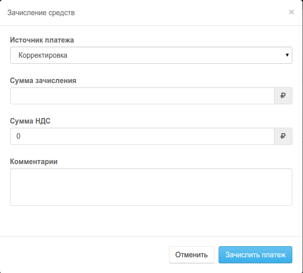

#Зачисления на рассчетный счет

Зачислене средств на расчетный счет может быть произведено вручную или при выполнеии пакетой опрации

## Ручное зачисление на расчетный счет

В примере (1) показана история операций с баллансом лицевого счета. 

 Ручная корретировка балланса 

 Ручное зачисление банговкого перевода

 Ручное зачисление электронных платежных ситем  

Для ручного зачисления средств на рассчетный счет нажмите кнопку `Зачислить`. Выберите источник платежа, Введите сумму, комментарии и нажмите кнопру `Зачислить платеж`. 

Будте внимательны! На событие `пополнение балланса` могут быть установлены правила, продлеавющие подписки, уведомления клиена и.т.п.

 

## Пакетное зачисление платежей

Пакетное зачисление платежей производится в разделе  

В систему PriсеPlan можно загружать банковские выписки или платежи из программы 1С. Priceplan автоматически распознает контрагента, если это возможно. 

После этого платеж можно зачислить на балланс клиента.

Прайсплан учитывает номер счета в комментариях к платежу для определения ID клиента однако не распределяет платеж по счетам. 

Платеж будет зачислен на балланс лицевого счета и распределен по списаниям очереди даты создания. "раньше создан создан - раньше оплачен".

