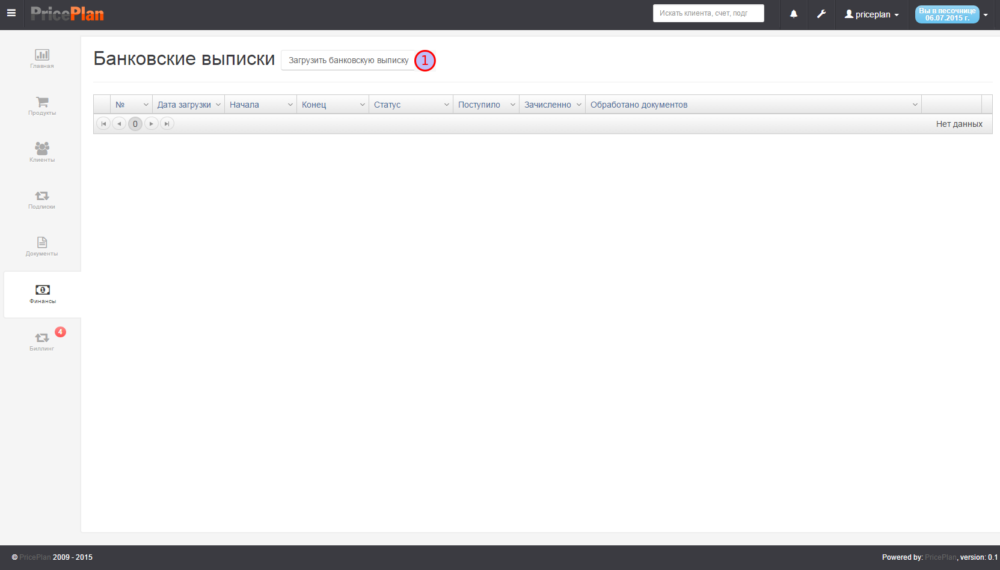
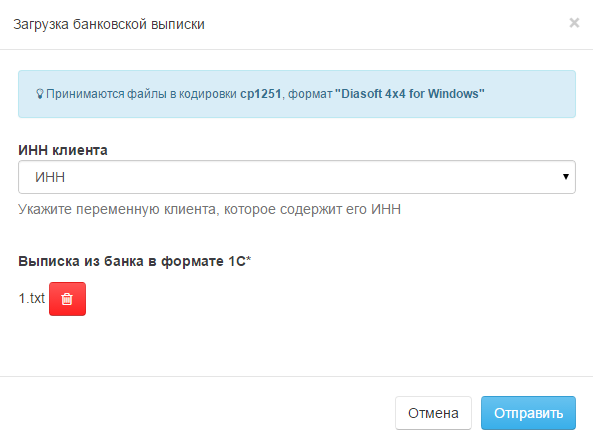
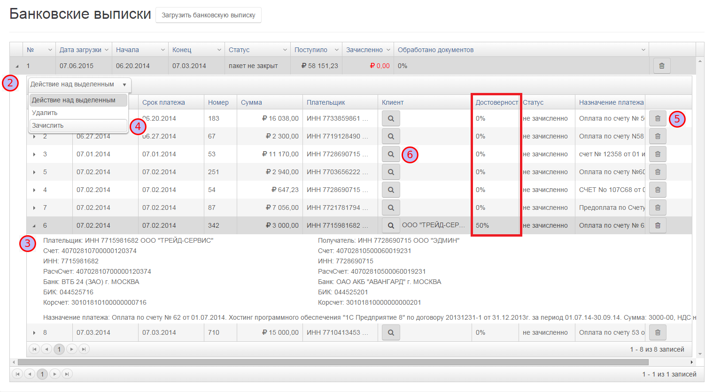
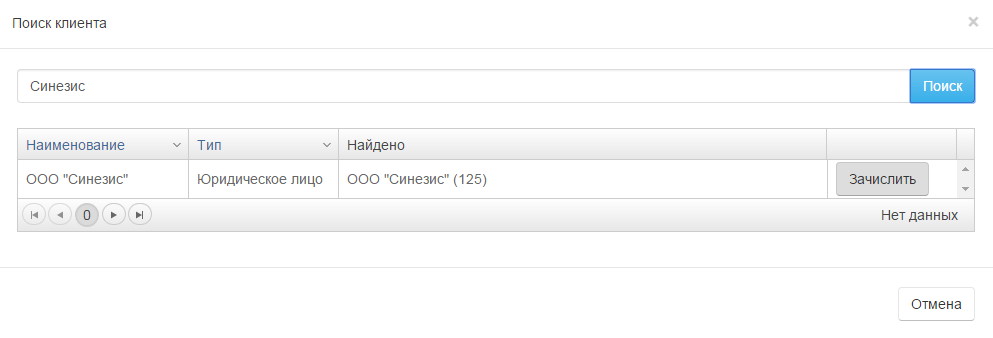

# Финансы

Вкладка "Финансы" предназначена для загрузки в систему информации, о поступивших денежных средствах на счета клиентов. Рис.1.  

 - кнопка загрузки банковской выписки в ручном режиме.

Загрузка банковской выписки может проводиться в ручном режиме или с использованием модуля интеграции с 1С [Ролик интеграция с 1С](http://www.youtube.com/watch?v=7wSDOFz_V2c)

## Загрузка банковской выписки

Для загрузки банковской выписки необходимо нажать кнопку , после этого, в открывшемся меню, выбрать файл банковской выписки. Рис.2.

> _**ВАЖНО!**_ Банковская выписка должна быть в формат "Diasoft 4x4 for Windows" и кодировке cp1251

После того, как файл выбран, необходимо нажать кнопку "Отправить". Загруженная банковская выписка, будет отражена в интерфейсе вкладки "Финансы". Рис.3. Для того, чтобы открыть банковскую выписку, нужно нажать на пиктограмму .  
Система автоматически идентифицирует платежи и проставляет вероятность в %. В случае, если ИНН в банковской выписке совпадает с ИНН клиента,то достоверность 50%, если платеж не идентифицирован, то в колонке "Достоверность" указывается 0%.

В интерфейсе банковской выписки отражены все поступившие и отправленные платежи. Для того, чтобы посмотреть реквизиты платежа, необходимо нажать на пиктограмму .  
Для зачисления средств на счет клиента, необходимо выбрать платеж и в меню "Действие над выделенным" выбрать команду "Зачислить"  . Удалить информацию о платеже, можно нажав на пиктограмму .

Для того, чтобы зачислить на счет клиента платеж, который система не смогла идентифицировать, необходимо открыть интерфейс поиска , найти клиента и зачислить платеж, нажав кнопку "Зачислить". Рис.4

